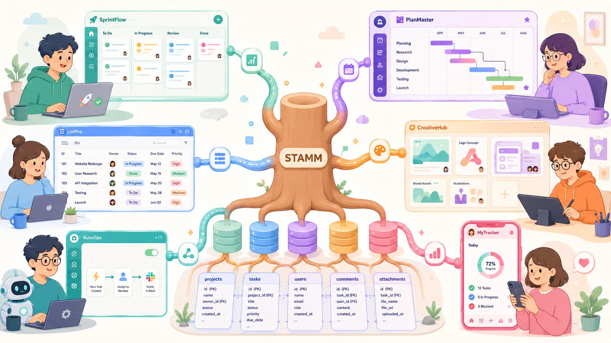

# Stamm

[](https://github.com/kawasima/stamm/actions/workflows/ci.yml)
[](https://www.eclipse.org/legal/epl-2.0/)
[](https://www.typescriptlang.org)
[](https://modelcontextprotocol.io)
[](https://zod.dev)

A headless project management system. There is no UI — stamm ships the **model**
and the **behavior** of issue tracking, and exposes them over the
[Model Context Protocol (MCP)](https://modelcontextprotocol.io) so that any
client (Claude Code, an editor, your own front end) can drive it. If you want a
UI, build the one you want on top of these tools.



The domain model is written in [Zod](https://zod.dev) first, drawing on
[Redmine](https://www.redmine.org), [GitHub Issues](https://github.com/features/issues),
and [Nulab Backlog](https://backlog.com).

## Features

What the tools cover today (one MCP tool per operation unless noted):

- **Issues** — create / read / update / delete; fetch by id, by key (`PROJ-123`),
  or as a detail view hydrated with its satellites; rich search (filter, sort,
  paginate); subtasks; move between projects; watchers.
- **Issue attributes** — assignees, labels, category, milestone, iteration,
  parent, schedule (start / due), estimation, progress, and custom-field values,
  all set through one compound `issue_update`.
- **Workflow** — status transitions constrained by a per-project/type workflow,
  with "available transitions" and status-change history.
- **Issue relations** — relate / unrelate / list (blocks, relates-to, …).
- **Comments** — add / edit / delete / list, with visibility.
- **Attachments** — attach / get / delete / list by reference (binary upload is
  not supported in v1).
- **Projects** — CRUD; archive / unarchive; visibility; parent / sub-projects;
  membership with roles.
- **Milestones** — CRUD; close / reopen / lock; progress.
- **Iterations** (sprints) — CRUD; progress.
- **Time tracking** — log / read / update / delete entries; list; summary.
- **Notifications** — list; unread count; mark one or all read.
- **Activity feed** — the append-only timeline every mutation writes to; list it
  newest-first (filter by project, user, action, target, or time range) or fetch
  one entry by id. It is also the source of each entity's created / updated
  timestamps.
- **Configuration** (admin, via `admin_*`) — statuses, priorities, labels, issue
  types, categories, roles, users, user groups; workflow transitions; default
  status per project/type.
- **Access control** — role-based permissions per project, with issue-visibility
  scoping (all vs own/assigned); account status (active / inactive); groups.
- **Authentication & transport** — local stdio (single pinned user) and remote
  HTTP with per-user EdDSA JWT auth; admin-managed signing keys (issue / revoke
  / list).

Modeled in `schema/` but not yet exposed as operations: wikis, saved views,
automations, templates, drafts, and webhooks.

## Layers

```text
src/
  schema/    Zod schemas — the single source of truth for every entity and operation
  behavior/  Behavior contracts — the operations exposed over the domain (the interface)
  impl/      SQL-backed implementation (Kysely; runs on SQLite today, Postgres-portable)
  mcp/       MCP server that maps each behavior contract onto an MCP tool
  http/      Remote HTTP transport + per-user JWT (EdDSA) authentication
  bin/       Entry points — stdio (stamm-mcp) and remote HTTP (stamm-http)
```

Each behavior is a contract (input/output Zod schema) in `schema/`, an interface
in `behavior/`, and a Kysely-backed implementation in `impl/domains/`. The MCP
layer in `mcp/catalog.ts` wires most behaviors 1:1 onto tools; config-resource
CRUD (status, priority, label, issue type, category, role, user, group) is folded
into the generic `admin_*` tools, and issue satellites (assignees, labels,
watchers, schedule) are folded into the compound `issue_update` tool.

## Getting started

Requires Node.js (built and tested on a recent LTS).

```sh
npm install
npm run build      # tsc -p tsconfig.build.json → dist/
npm test           # vitest
```

The first run against a fresh database bootstraps an admin user, a member, a
default project, and a default issue type / priority / status, so the server is
usable immediately.

## Quickstart — create and read an issue

Here is the whole loop end to end: spawn the stdio server, file one issue, read
it back. It uses the official [MCP SDK](https://github.com/modelcontextprotocol/typescript-sdk)
client and talks to the same tools any client would. The runnable version is
[`sim/quickstart.mjs`](sim/quickstart.mjs) — after `npm run build`, run
`node sim/quickstart.mjs` (prints `created default-1: Login is broken`).

```js
import { Client } from "@modelcontextprotocol/sdk/client/index.js";
import { StdioClientTransport } from "@modelcontextprotocol/sdk/client/stdio.js";

const transport = new StdioClientTransport({
  command: "node",
  args: ["dist/bin/stamm-mcp.js"],
  env: { ...process.env, STAMM_DB: "quickstart.db" },
});
const client = new Client({ name: "quickstart", version: "0" });
await client.connect(transport);

const call = async (name, args = {}) => {
  const res = await client.callTool({ name, arguments: args });
  if (res.isError) throw new Error(`${name}: ${JSON.stringify(res.content)}`);
  return res.structuredContent;
};

// The stdio transport pins you to the seeded member, so calls carry no actorId.
// Reads stay open to members — resolve the seeded ids needed to file an issue.
const project = await call("project_get_by_identifier", { identifier: "default" });
const page = { pagination: { limit: 20 } };
const types = await call("admin_list", { params: { resource: "issue_type", ...page } });
const priorities = await call("admin_list", { params: { resource: "priority", ...page } });

const created = await call("issue_create", {
  projectId: project.id,
  issueTypeId: types.items[0].id,
  priorityId: priorities.items[0].id,
  subject: "Login is broken",
});
const issue = await call("issue_get", { issueId: created.id });
console.log(`created ${issue.key}-${issue.number}: ${issue.subject}`);

await client.close();
```

## Running the MCP server

stamm exposes the same tools over two transports. Run `npm run build` before
either — both run from `dist/`.

### Local (stdio) — single pinned user

For one local client (Claude Code on your machine, an editor):

```sh
npm run mcp        # node dist/bin/stamm-mcp.js
```

- `STAMM_DB` — path to the SQLite file (defaults to `./stamm.db`)
- `STAMM_ACTOR` — pinned user id to act as (defaults to the bootstrapped member)

To register stamm with a local MCP host, point it at the built entry point. The
included `.mcp.json` does this for Claude Code:

```json
{
  "mcpServers": {
    "stamm": {
      "command": "node",
      "args": ["dist/bin/stamm-mcp.js"],
      "env": { "STAMM_DB": "stamm.db" }
    }
  }
}
```

### Remote (HTTP) — multiple users, per-user authentication

Run one shared stamm and let each team member point their own client at it.
Identity is per request: clients authenticate with a JWT, and the server pins
the operating user to the token's subject — clients never send (or can spoof) a
user id.

```sh
npm run http       # node dist/bin/stamm-http.js
```

- `STAMM_DB` — sqlite file (defaults to `./stamm.db`)
- `STAMM_HTTP_PORT` — listen port (default `3000`)
- `STAMM_HTTP_HOST` — listen host (default `127.0.0.1`)
- `STAMM_HTTP_PATH` — MCP endpoint path (default `/mcp`)
- `STAMM_JWT_ISS` / `STAMM_JWT_AUD` — optional expected `iss` / `aud` claims
- `STAMM_SEED_KEYS_FILE` — where first-boot seed private keys are written (default `./stamm-seed-keys.json`)

> **Run it behind TLS.** The server speaks plain HTTP. Bearer tokens and the
> private keys returned by `user_key_issue` are secrets — terminate TLS at a
> reverse proxy (or keep `STAMM_HTTP_HOST` on loopback and proxy to it). Don't
> expose plain HTTP beyond localhost.

**Authentication.** Each user holds an Ed25519 keypair. The server stores only
the public key; the user keeps the private key and signs **short-lived** JWTs
with it (`alg: EdDSA`, `kid` = the key id, `sub` = their user id, and a required
`exp`). On every request the server looks up the subject's public key, verifies
the signature, enforces `exp` plus a max token age, and checks the account is
still active. Tokens without `exp`, beyond the max age, or for a
deleted/deactivated user are rejected. Always set `kid` so the lookup hits one
key directly.

A fresh database bootstraps an admin and a member and mints a key for each. The
private keys are written **once** to `stamm-seed-keys.json` (mode `0600`; path
overridable via `STAMM_SEED_KEYS_FILE`) — distribute them to their owners and
delete the file. To mint keys for more users, an admin calls the
`user_key_issue` tool (over either transport); the private key is returned
exactly once.

Sign a request token from an issued private JWK (using [jose](https://github.com/panva/jose)):

```js
import { importJWK, SignJWT } from "jose";

const key = await importJWK(privateJwk, "EdDSA");
const token = await new SignJWT({})
  .setProtectedHeader({ alg: "EdDSA", kid })
  .setSubject(userId)
  .setIssuedAt()
  .setExpirationTime("5m")
  .sign(key);
```

Then send it as a bearer token on the MCP endpoint:

```sh
curl -H "Authorization: Bearer $TOKEN" \
     -H "Content-Type: application/json" \
     -H "Accept: application/json, text/event-stream" \
     -d '{"jsonrpc":"2.0","id":1,"method":"initialize","params":{"protocolVersion":"2025-06-18","capabilities":{},"clientInfo":{"name":"my-client","version":"0"}}}' \
     http://127.0.0.1:3000/mcp
```

MCP clients that support a remote (Streamable HTTP) server can connect by URL
with the same `Authorization` header. Requests without a valid token get `401`.

## Scripts

| Command | Description |
| --- | --- |
| `npm run build` | Compile to `dist/` |
| `npm run check` | Type-check without emitting |
| `npm test` | Run the test suite once |
| `npm run test:watch` | Run tests in watch mode |
| `npm run mcp` | Start the MCP server over stdio (single pinned user) |
| `npm run http` | Start the MCP server over HTTP (per-user JWT auth) |

## License

[Eclipse Public License 2.0](LICENSE) (EPL-2.0).
